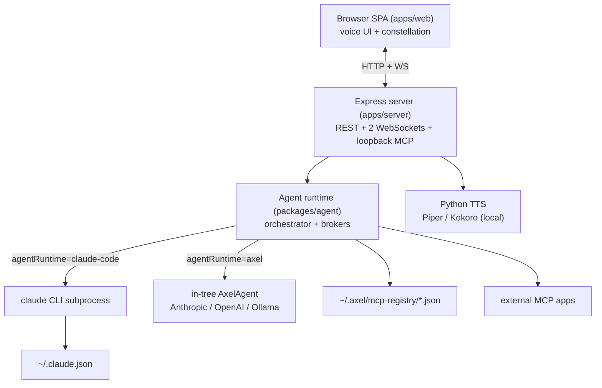
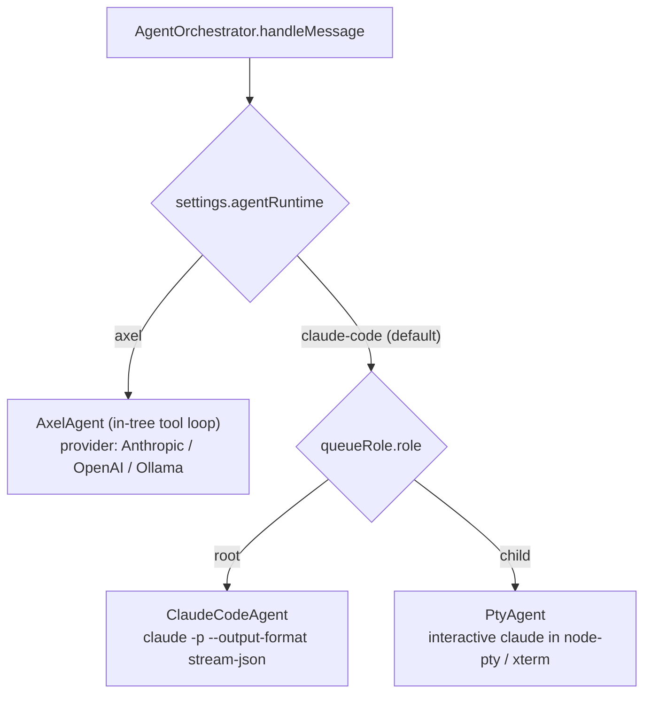
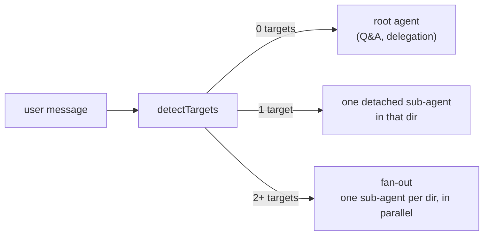
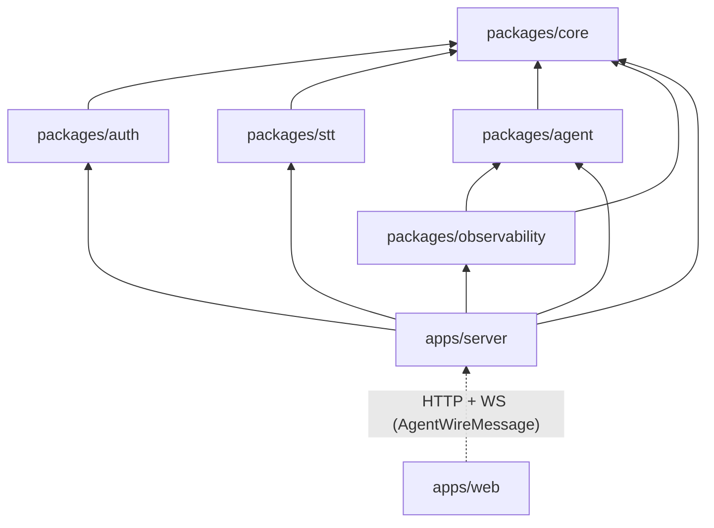
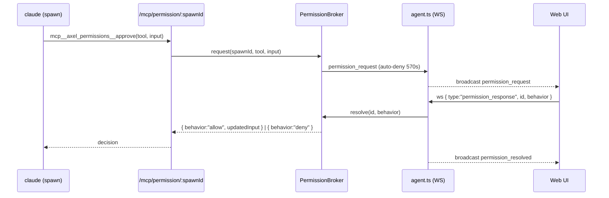
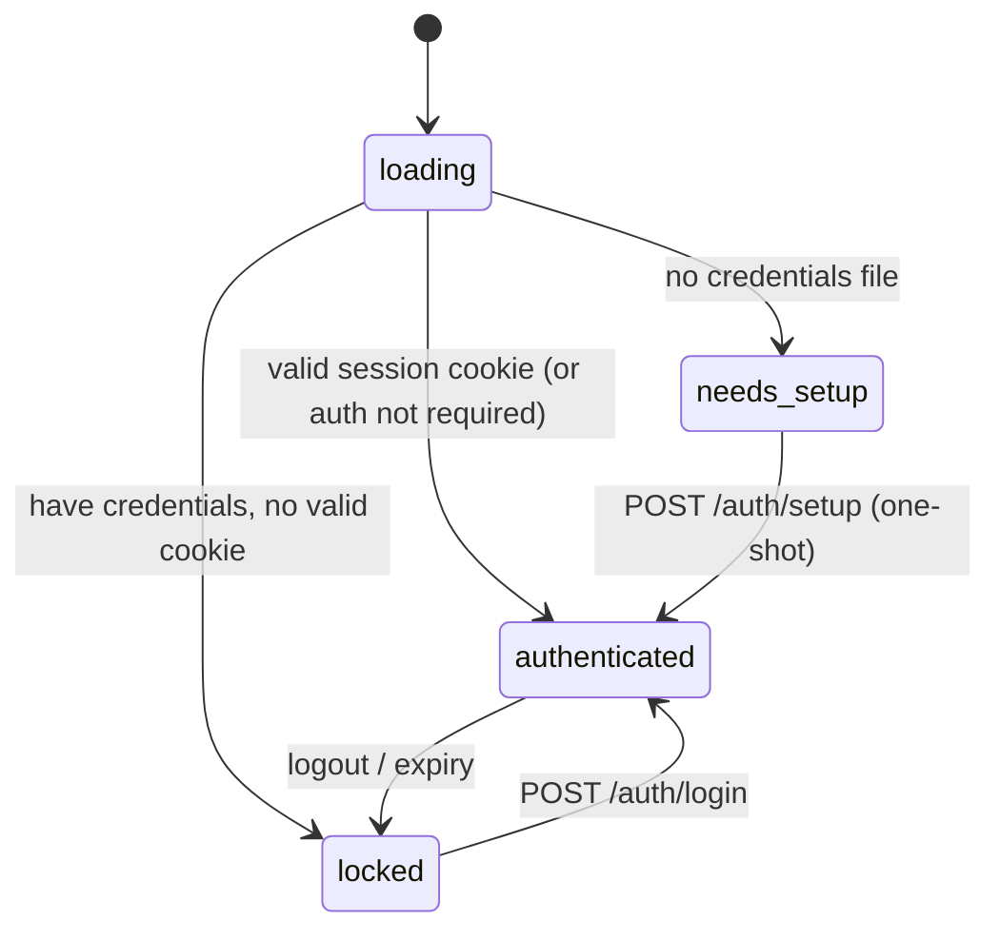

# Axel Architecture

This document describes how Axel is put together: the system context, the agent runtimes, the request/data flows, the package layout, and the key design decisions. For the voice-pipeline deep dive (queues, pending asks, server fan-out invariants) see [voice-flow.md](voice-flow.md).

---

## System context

Axel runs as a single Express server on your machine or home server. A browser (phone or laptop, reached over a private network) talks to it over HTTP plus two WebSockets. The server orchestrates an agent runtime, which either drives the `claude` CLI as a subprocess or runs an in-tree multi-provider loop. Local Python handles text-to-speech. Nothing leaves the host except the model API call — and with a local model (Ollama) even that stays on the host.



The web client and server share no compile-time code; the contract between them is the `AgentWireMessage` union (`packages/agent/src/types.ts`), mirrored on the client in `useVoiceInterface.ts`.

---

## Agent runtimes

`AgentOrchestrator` is runtime-agnostic — it calls `getAgent(): AgentRuntime` and never hardcodes a backend. `apps/server/src/services.ts` `selectAgentRuntime(settings)` resolves which runtime serves a given spawn, re-reading live settings each turn so a settings change takes effect on the next message without a restart.



- **`claude-code` (default).** A hybrid: **root** spawns use `ClaudeCodeAgent`, which runs `claude -p … --output-format stream-json` and translates the stream into wire events (this powers streaming voice). **Child** spawns (project sub-terminals) use `PtyAgent`, a long-lived interactive `claude` session in a node-pty, surfaced in an xterm view you can watch.
- **`axel` (in-tree, multi-provider).** `AxelAgent` runs its own tool loop with no external binary, backed by a provider factory (`packages/agent/src/providers/`) for **Anthropic**, **OpenAI**, or local **Ollama**. A `modelTier` (`frontier` / `mid` / `q4-local` / `q2-local`, see `promptTiers.ts`) tightens confirmation gates and output structure for weaker local models. This path is supported and under active development.

### Target routing

On every user turn the orchestrator runs `detectTargets(message, listProjects(root))` — a heuristic match of the message against project directory names — and routes three ways:



Sub-agents run **detached**: the root turn ends as soon as the hand-off is announced, so you can speak the next request while children stream target-tagged events. Continuity is keyed per `(axelSessionId, targetId, term)`, and `childQueues` serializes consecutive turns sent to the *same* terminal (they share one `claude --resume` session). The root never works on project files inline — it always delegates via `open_terminal` (see `PromptBuilder` ROOT_DELEGATION).

---

## Voice request flow

```mermaid
sequenceDiagram
    participant U as User
    participant W as Web (useVoiceInterface)
    participant S as Server (/agent/stream)
    participant O as AgentOrchestrator
    participant C as ClaudeCodeAgent → claude
    participant T as /tts/synthesize

    U->>W: tap orb, speak
    W->>W: webkitSpeechRecognition → transcript
    W->>S: ws { type:"main_input", text, location }
    S->>O: enqueue on mainQueue → handleMessage
    O->>C: build prompt, run (stream-json)
    C-->>S: token / message_end / tool_use events
    S-->>W: unicast tokens, broadcast prompts
    W->>T: POST each completed message (piper/kokoro)
    T-->>W: WAV bytes
    W->>U: play audio in order; re-arm mic on done
```

Speech-to-text is browser-only (`webkitSpeechRecognition`); there is no server-side STT and no audio upload. `@axel/stt` defines a provider interface for a future server-side engine but is unwired today. TTS streams per `message_end` so playback starts before the full response is done; sustained voice energy triggers barge-in to interrupt playback.

There are two client-side intercepts before a transcript is sent: a pending **voice-ask** gate (`useVoiceAsks.route`) and nothing else — every other utterance is sent verbatim as `main_input`. (An older client-side "read the transcript" intent matcher was removed; background-terminal relaying now happens server-side through the BACKGROUND TERMINALS prompt section.)

---

## Package map



### `@axel/core`
Shared types + execution utilities.
- **`AuditLogger`** — appends every tool execution as JSONL (`flags:'a'`, never truncates; disables itself on write error).
- **`isPathUnder`** / **`PermissionGuard`** — the directory allowlist (resolved via `realpath` to defeat symlink traversal) and `DENIED_PATTERNS` for destructive shell commands.
- **`spawnEnv`** — builds the child-process env (parent `PATH`/`HOME` plus injected `CLAUDE_PATH`/`ANTHROPIC_API_KEY`).
- **Types** (`types/api.ts`, `types/auth.ts`) — `AppSettings`, `PermissionMode` (`default | acceptEdits | bypassPermissions`), `EffortLevel` (`low | medium | high | xhigh | max`), the runtime keys (`agentRuntime`, `runtimeProvider`, `runtimeModel`, `runtimeBaseURL`, `modelTier`), and the wire/auth shapes. `ModelProvider` exists as a legacy field and is not used for runtime selection.

### `@axel/auth`
- **`PasscodeService`** — `argon2id`, `m=65536` (64 MiB), `t=3`, `p=1`.
- **`SessionManager`** — stateless HMAC-SHA256 tokens, `base64url(payload).sig`, payload `{ sessionId, issuedAt, expiresAt }`, verified with `timingSafeEqual`. `revoke(token)` decodes it and adds the `sessionId` to an in-memory revoked set (cleared on restart).
- **`RateLimiter`** — a per-IP failure counter with a hard lockout: after `AUTH_MAX_ATTEMPTS` (3) failures it locks for `AUTH_LOCKOUT_MS` (5 min), then resets. Not a sliding window.

### `@axel/agent`
The orchestration layer.
- **`AgentOrchestrator`** — the single entry for a user turn; `detectTargets` routing, per-session/per-terminal resume maps, in-flight dir counters, and server-side child transcript buffers that feed the root's BACKGROUND TERMINALS prompt section.
- **`AgentRuntime`** — the interface implemented by `ClaudeCodeAgent`, `PtyAgent`, and `AxelAgent`.
- **`ClaudeCodeAgent`** / **`PtyAgent`** — stream-json subprocess (root) and interactive node-pty session (child).
- **`AxelAgent`** + **`providers/`** + **`tools/`** + **`Conversation`** — the in-tree multi-provider runtime and its tool set.
- **`McpRegistry`** — reads `~/.axel/mcp-registry/*.json`, normalizes http/stdio entries, generates the per-spawn temp `--mcp-config` (mode `0o600`, registered apps + the per-spawn `axel_*` bridges), and watches the dir to push live `tool_catalog` updates.
- **`PromptBuilder`** — composes the system prompt (voice rules + confirmation gates + filesystem allowlist + ROOT_DELEGATION or CHILD_WORKER + connected MCP apps + orb location + child status).
- **Brokers** — bridge in-process state to the loopback MCP routes and the WS: `PermissionBroker` (allow/deny), `AskBroker` (root `ask_user`), `RequestQueue` (child→root request queue, one item per turn), `TerminalBroker` (`open_terminal`), `TerminalReadBroker` (`read_terminal`), `FileOpenBroker` (`open_file`), `CleanupBroker` (`close_idle_dirs`), `ReportBroker` (child end-of-turn summaries), and `AppBroker` (built-in timer/notes apps).

### `@axel/stt`
Type-only `STTProvider` interface — a seam for a future server-side STT engine. No concrete implementation is wired in; speech-to-text runs in the browser.

### `@axel/observability`
Append-only per-session interaction recorder plus a read layer for diagnosing UI-vs-backend divergence. `ObservabilityRecorder` writes a chronological JSONL feed (user/control inputs, every `AgentWireMessage`, raw model turns from the `axel` runtime, throttled UI-state snapshots) under `OBSERVABILITY_DIR`; `SessionReader`/`reconstruct`/`diffUiVsBackend` read it back, and a read-only stdio MCP server (`axel-observe-mcp` bin) exposes the same views to an external debugging agent. Recording is on by default (local disk only) and disabled with `OBSERVABILITY_ENABLED=false`.

### `apps/server`
Express 5 + `ws`.
- **`index.ts`** — app assembly, dual HTTP (`0.0.0.0:PORT`) + dev HTTPS (`PORT+1`, self-signed cert with a LAN-IP SAN so iOS `getUserMedia`/speech works), the WS upgrade router (`/agent/stream` and `/agent/pty/:spawnId`), `SESSION_SECRET` entropy validation (fatal in production), CORS, and boot probes (`claude --version`, python piper import) plus the `ProjectsWatcher`, registry, and broker → WS bridges.
- **`config.ts`** — the one place env vars are read; derives all paths and locates the `claude`/python binaries.
- **`services.ts`** — constructs every singleton and `selectAgentRuntime`.
- **Routes** — `auth.ts` (status/setup/login/logout + QR pair create/consume), `claudeAuth.ts` (claude OAuth lifecycle), `tts.ts` (`POST /tts/synthesize`), `network.ts` (settings, fs browse/read/write, projects, mcp list, Ollama models/pull), `session.ts` (`POST /api/session/reset`), `health.ts`, and the loopback MCP bridges (`mcpPermission`, `mcpTerminal`, `mcpFiles`, `mcpApps`, `mcpCleanup`, `mcpAsk`, `mcpQueue`, `mcpReport`, `mcpTerminalRead`).
- **Services** — `SettingsManager` (persists `settings.json`, redacts `apiKeys` on read), `ClaudeAuthService` (drives `claude auth login` via the python PTY helper), `PairTokenStore` (single-use QR tokens), `ProjectsWatcher`.

### `apps/web`
React 18 + Vite SPA. `App.tsx` gates on `useAuth` (loading / needs_setup / locked / authenticated). `useVoiceInterface` opens `/agent/stream`, translates the wire protocol into UI state, and drives TTS, voice-asks, and barge-in. The Constellation tree (`layout/`, `engine/`, `galaxy3d/`) renders the orb + project "star systems", sub-terminal tabs (xterm `PtyView` over `/agent/pty/:spawnId`), file windows, the MCP tool bubble bar, prompt cards, and the queue badge.

---

## Loopback MCP bridges

When a runtime spawns, it injects per-spawn `axel_*` MCP servers pointing at loopback Express routes, keyed by an unguessable `spawnId` that doubles as the capability. The `claude` subprocess (or `AxelAgent`) calls these like any MCP tool; the route validates the loopback origin (`127.0.0.1`) and `spawnId`, then delegates to the matching broker singleton, which mutates state and/or emits a WS event.

| MCP server / tool | Route | Broker | Purpose |
|---|---|---|---|
| `axel_permissions` / `approve` | `/mcp/permission/:spawnId` | PermissionBroker | the `--permission-prompt-tool` for gated calls |
| `axel_terminals` / `open_terminal` | `/mcp/terminal/:spawnId` | TerminalBroker | open a project sub-terminal |
| `axel_terminal_read` / `read_terminal` | `/mcp/terminal-read/:spawnId` | TerminalReadBroker | root reads a child terminal's output |
| `axel_files` / `open_file` | `/mcp/files/:spawnId` | FileOpenBroker | open a file window in the UI |
| `axel_ask` / `ask_user` | `/mcp/ask/:spawnId` | AskBroker | root multiple-choice question |
| `axel_queue` / `request`,`list`,`claim`,`resolve` | `/mcp/queue/:spawnId` | RequestQueue | child→root request queue |
| `axel_report` / `report` | `/mcp/report/:spawnId` | ReportBroker | child end-of-turn summary |
| `axel_cleanup` / `close_idle_dirs` | `/mcp/cleanup/:spawnId` | CleanupBroker | tidy idle terminals |
| `axel_apps` / timer, notes | `/mcp/apps` | AppBroker | built-in apps (shared, no spawnId) |

Registered external apps from the registry are merged into the same temp `--mcp-config`; the built-in `axel_*` bridges are written last so a registered app can't shadow them.

---

## Permission & queue flow

Two paths surface user decisions. The **root** permission prompt is broadcast (so a reloaded tab still receives it) and answered over the agent WebSocket — **not** an HTTP route. A **child** cannot prompt directly, so it enqueues a request that the root drains one item per turn.



The MCP entry's transport timeout is 600 s; the broker auto-denies at 570 s so the deny always wins and no spawn hangs. The child queue path: `mcp__axel_queue__request` → `queue_added` broadcast → constellation badge → an auto-wake pulls the root in → root `list`/`claim`/`resolve` presents one item, and `resolve` unblocks the child with `{ accepted, answer }`.

Beyond `permission_*`, the server broadcasts `question_request`/`question_resolved`, `queue_added`, `tool_catalog`, `app_state`, and `fs_changed`; tokens and per-target events are unicast. A 25 s WS ping/pong keeps mobile NAT connections alive.

---

## Auth, sessions & first run



- Auth is enforced when `REQUIRE_AUTH=true` or `NODE_ENV=production`; a plain local run leaves it off.
- `POST /auth/setup` creates the single account (Argon2id) and then permanently returns 409. Login verifies the hash in constant-ish time and issues an HMAC-signed session cookie (`httpOnly`, `sameSite=strict`, 30-day `maxAge`). `data/credentials.json` and `settings.json` are written mode `0600`.
- **Phone pairing:** an authed desktop calls `POST /auth/pair/create` → `PairTokenStore` issues a single-use short-TTL token → the UI shows a QR with the LAN IP + HTTPS port. The phone scans → `GET /auth/pair/consume?token=…` sets a session cookie once, no password typed.
- **Claude (model) auth is separate:** `ClaudeAuthService` drives `claude auth login` through `python/claude_oauth.py` in a PTY, captures the OAuth URL, and relays the pasted code until `~/.claude.json` has an account. An `ANTHROPIC_API_KEY` (env or Settings) takes precedence over the CLI login.

---

## Constellation rendering engine

The Constellation UI is driven by a single `requestAnimationFrame` clock that lerps every node's `{cx, cy, r, o}` between keyframes — a pipeline of pure layout functions feeding one render component.

```
 user input        project tree            WS events
     │                  │                       │
     ▼                  ▼                       ▼
 useDragEngine   useConstellationTree   useVoiceInterface
     └────────┬─────────┘                       │
              ▼                                  │
     useConstellationEngine                      │
              ▼                                  │
     computeLayout(stage, tree)                  │
       ├ fanAngles.ts   (orbiter spread)         │
       ├ branchWeight.ts(visual weight)          │
       ├ orbiters.ts    (ring placement)         │
       ├ labels.ts      (deferred overlay)       │
       └ geo.ts         (Pt / Circle math)       │
              ▼                                  │
     LayoutFrame ─► single rAF tick (ease/lerp) ◄┘
              ▼
     AnimState {cx,cy,r,o,v} per node ─► ConstellationScene (SVG)
                                            └► Galaxy3D (three.js, when view3d)
```

Why one clock: every visual property stays in lockstep (orbiter rotation, dot openness, ancestor visibility, orb commute), the clock is `localStorage`-persisted so layout is stable across refreshes, and `DT_CLAMP_MS = 80` prevents a backgrounded tab from jumping when it re-foregrounds. `view3d` swaps `ConstellationScene` for `Galaxy3D`, which mounts a three.js scene consuming the same `LayoutFrame`.

---

## Key design decisions

**A runtime abstraction, claude-CLI by default.** The default `claude-code` runtime shells out to the `claude` binary rather than reimplementing the agent loop: the CLI handles OAuth, model selection, `--resume`, the full tool-use loop, `--mcp-config` injection, and `--permission-prompt-tool` routing. The tradeoff — a dependency on the `claude` binary being installed and authenticated — is surfaced at boot. The in-tree `axel` runtime exists for people who want to run open/local models without that binary; both implement the same `AgentRuntime` interface so the orchestrator doesn't care which is active.

**Single-user, session-based auth.** Exactly one account; the setup endpoint closes after first use. No user IDs in the token, no per-user isolation, IP-only rate limiting.

**MCP registry via filesystem, not env vars.** Adding/removing an app is dropping/deleting a JSON file in `~/.axel/mcp-registry/` — re-read every invocation, no restart. A debounced watcher also pushes live `tool_catalog` updates to the UI.

**Filesystem allowlist with symlink resolution.** Paths are resolved via `realpath` before being checked against `ALLOWED_DIRS`, so the agent can't escape the allowlist through a symlink.

**Append-only audit log.** Every tool call, allowed or denied, is written with `flags:'a'` and never truncated — a tamper-evident record of what the agent did.

**Detached children + per-terminal continuity.** One message can spawn N child agents; the root returns immediately and continuity is preserved per `(session, target, term)`.

**Permissions are user-decided by default.** `permissionMode` defaults to `default` (every gated call → a UI card + voice ask). `acceptEdits` and `bypassPermissions` are opt-in. The 570 s auto-deny guarantees no spawn hangs.

**Local-only TTS.** The TTS subprocess uses local models only (Piper / Kokoro); the browser Web Speech API is the fallback. Deliberate: a public, audio-heavy app over a paid TTS API would be a cost trap.

**Voice format enforced in the prompt.** Voice-response rules and confirmation gates live in the system prompt (`PromptBuilder`), not in post-processing — the client speaks the agent's text as-is.

---

## How to extend Axel

**Add MCP tools.** Drop a JSON file in `MCP_REGISTRY_DIR` (default `~/.axel/mcp-registry/`). Format in [MCP_REGISTRATION.md](../MCP_REGISTRATION.md). No restart.

**Add a provider to the `axel` runtime.** Implement the provider contract in `packages/agent/src/providers/` and register it in the factory; expose it as a `runtimeProvider` option in Settings.

**Add a voice intercept or pending ask.** See the "Adding a new voice-ask flow" section of [voice-flow.md](voice-flow.md) — the recognition gate, TTS queueing, and mic re-arm are already wired.

**Add a TTS engine.** Add an entry to the `ENGINES` map in `apps/server/src/routes/tts.ts`, add any Python deps to `python/requirements.txt`, and add the id to `useTtsEngine.ts` + a button in the Settings panel. Keep it local.

**Add a render skin.** `view3d` switches `ConstellationScene` (SVG) and `Galaxy3D` (three.js); a third skin consumes the same `LayoutFrame` behind a new `view*` flag.

**Change the auth mechanism.** All auth logic is in `packages/auth/`; swap the implementation and update `services.ts` + `routes/auth.ts`. The cookie format and `sessionGuard` only change if the token format does.
